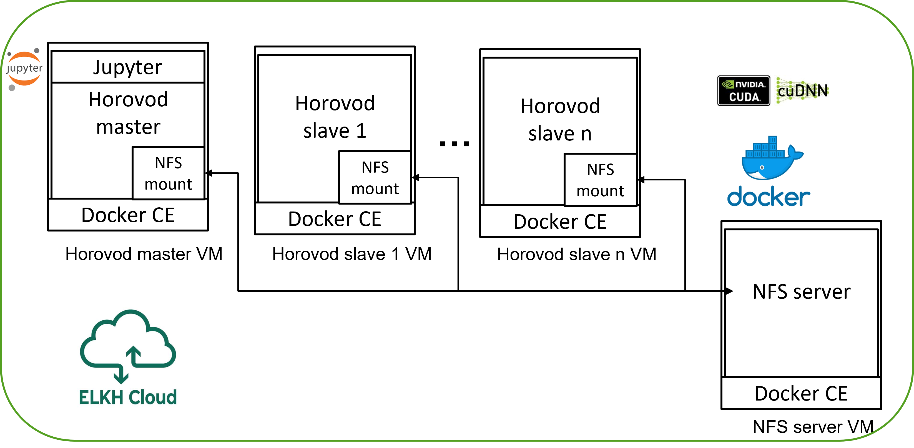

# Horovod referencia architektúra

A Horovod egy elosztott gépi tanulási keretrendszer a TensorFlow, Keras, PyTorch és az Apache MXNet keretrendszerek számára. A Horovodot eredetileg az Uber fejlesztette ki, hogy az elosztott gépi tanulás gyorsan és egyszerűen alkalmazható legyen, így a neurális hálózatok tanítási ideje nagy mértékben csökkenthető. A Horovod segítségével a neurális hálózatok tanítása könnyedén párhuzamosítható, hogy akár több száz GPU-n futtatható legyen, az eredeti kód minimális módosítása mellett.

A Horovod referencia architektúra segítségével, a Terraform és Ansible eszközök használatával az alábbi infrastruktúra építhető ki az ELKH Cloudon:



Az egyes Horovod állomások Docker konténerekben kerülnek kialakításra a virtuális gépeken. Kineveztünk egy master állomást, amely tartalmaz egy Jupyter Lab-ot az elosztott gépi tanulás kezeléséhez. Az állomások között egy NFS alapú hálózati meghajtó biztosítja a tanító adatok elosztását. Az állomások hálózati beállításai és tűzfal szabályai (security groups) is automatikusan létrehozásra és konfigurálásra kerülnek. A referencia architektúra, a felhő platformon létrehozott controller állomásról kerül kiépítésre.

## Tulajdonságok

- Elosztott gépi tanulási alkalmazások támogatása
- Jupyter Lab felület biztosítása az elosztott gépi tanulás kezelésére
- Megosztott hálózati meghajtó az állomások között

## Előfeltételek

- SSH kulcs beállítása az ELKH Cloudon [1]
- Ubuntu 20.04 alapú controller állomás létrehozás az ELKH Cloudon [1]
- Publikus IP cím rendelése a controller állomáshoz és SSH kapcsolat engedélyezése [1]
- A controller állomáson a Terraform és Ansible telepítése
- Terraform telepítése a [hivatalos telepítési leírás alapján](https://learn.hashicorp.com/tutorials/terraform/install-cli):

```
sudo apt-get update && sudo apt-get install -y gnupg software-properties-common curl
curl -fsSL https://apt.releases.hashicorp.com/gpg | sudo apt-key add -
sudo apt-add-repository "deb [arch=amd64] https://apt.releases.hashicorp.com $(lsb_release -cs) main"
sudo apt-get update && sudo apt-get install terraform
```

- Ansible telepítése a [hivatalos telepítési leírás alapján](https://docs.ansible.com/ansible/latest/installation_guide/intro_installation.html):

```
sudo apt install python3-pip
sudo python3 -m pip install ansible
```

## Letöltés

A leíró fájlok az alábbi linken érhetők el: [Horovod leírók](https://git.science-cloud.hu/farkas/raf-horovod/-/archive/master/raf-horovod-master.tar.gz)

## Telepítés

1. Belépés a korábban létrehozott controller állomásra az alábbi paranccsal:
``` 
ssh -A ubuntu@PUBLIKUS_IP 
```

2. A leírófájlok letöltése és kicsomagolása:

```
wget https://git.sztaki.hu/farkas/raf-horovod/-/archive/master/raf-horovod-master.tar.gz -O raf-horovod.tar.gz
tar -zxvf raf-horovod.tar.gz
cd raf-horovod
```

3. Horovod leírók testreszabása:

- Az `auth_data.auto.tfvars` fájlban szükséges megadni az ELKH Cloud authentikációs információkat az alábbi formában:
```
auth_data = ({
    user_name= "SET_YOUR_USER_NAME"
    password= "SET_YOUR_PASSWORD"
})
```
- Az `resources.auto.tfvars` fájlban szükséges megadni a Horovod állomások tulajdonságait az alábbiak szerint:
  - Az `openstack_provider` résznél szükséges megadni az ELKH Cloud-ban használt projekt azonosítót.
  - A `horovod_master_node` résznél szükséges megadni a korábban beállított SSH kulcs nevét és a projekthez rendelt és használni kívánt Publikus IP címet. [1]
  - A `horovod_worker_node` résznél szükséges megadni a korábban beállított SSH kulcs nevét és a létrehozandó Horovod állomások számát.
  - A többi változó esetén az alapértelmezett értékek igény szerint módosíthatók.


4. A Horovod klaszter kiépítése:
```
terraform init
terraform apply -auto-approve
```

5. (Opcionális) Horovod klaszter lebontása:
```
terraform destroy
```

## Használat

1. A Jupyter Lab felület elérése:
- Lépjen be a horovod_master állomásra a korábban megadott publikus IP cím és SSH kulcs segítségével.
- Futtassa le az alábbi parancsot a Jupyter Lab cím lekérdezéséhez:
```
sudo docker logs horovod_master
```
A kapott címben a `127.0.0.1` cím helyére illessze be a horovod_master gép publikus IP címét a Jupyter Lab felület eléréséhez.

2. Példakód futtatása a Horovod klaszteren:
- A Jupyter Lab felületen egy Terminal ablakban futtatható alábbi parancs, amellyel elindul egy példa tanítási folyamat:
```
horovodrun -np 2 -H host1:1,host2:1 -p 12345 python /examples/tensorflow2_mnist.py
```
A `hostn` értékeke helyére a létrehozott Horovod állomások privát címét kell megadni.
A `horovodrun` parancs használatáról további információ a [hivatalos dokumentációban](https://horovod.readthedocs.io/en/stable/running_include.html) olvasható.

Amennyiben a tanítási folyamat elindul és látható, hogy minden állomás részt vesz a tanításban, akkor a Horovod klaszter megfelelően került kiépítésre.

## Források
[1] [ELKH Cloud Bevezető előadás](https://science-cloud.hu/sites/default/files/2021-04/1%20Az%20ELKH%20Cloud%20bemutat%C3%A1sa%281%29.pdf)